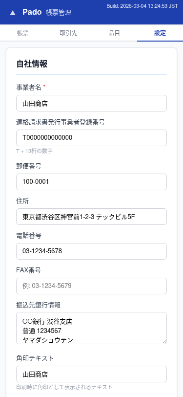

# pado -- 帳票管理アプリ

**紙の帳票はもう不要。ブラウザだけで、今日から使える帳票管理。**

個人事業主・小規模事業者向けに設計された、完全無料のブラウザ完結型帳票管理アプリケーションです。
サーバー不要、インストール不要。ブラウザを開くだけで使い始められます。


---

## なぜ pado？

小規模事業者にとって、帳票管理システムは「高すぎる・複雑すぎる・大げさすぎる」。
pado は、紙の帳票の手軽さとデジタルの便利さを両立するために作られました。

- **サーバー不要** -- データはお使いの端末内（ブラウザ）に保存。外部に送信されません
- **月額 0 円** -- ずっと無料で使えます
- **3 分で開始** -- アカウント登録不要。ブラウザでアクセスすれば即利用開始

---

## 主な機能

### 帳票管理

見積書・発注書・請求書・納品書・売上伝票・仕入伝票・領収書の作成・編集・管理をシンプルな画面で。
帳票番号の自動採番、テンプレート管理、PDF出力にも対応しています。


### 印刷・PDF出力

インボイス制度対応の帳票レイアウトで印刷。領収書はコンパクトレイアウトに対応。

<p>


</p>

### 取引先・品目管理

取引先情報の登録・検索・編集。取引先コードの自動採番、ふりがな検索に対応。
品目マスタを登録しておけば、帳票作成時にワンクリックで単価・税区分を自動入力できます。

<p>


</p>

### その他の機能

- **データエクスポート/インポート** -- JSON形式でバックアップ・復元・他端末への移行
- **PDF出力** -- 帳票をPDF形式で出力・印刷
- **表示設定** -- 使わない帳票種別を非表示にしてすっきり運用

---

## pado の特徴

| | |
|---|---|
| **完全オフライン対応** | インターネット接続なしで動作。PWA としてホーム画面に追加可能 |
| **プライバシー保護** | データは端末内の IndexedDB に保存。サーバーへの送信は一切なし |
| **データポータビリティ** | JSON エクスポートでバックアップ。端末の移行もファイル1つで完了 |
| **マルチデバイス** | PC・タブレット・スマートフォンに対応したレスポンシブデザイン |

### モバイル対応

スマートフォンでも快適に操作できるレスポンシブデザイン。

<p>


</p>

---

## 開発者向け情報

### 技術スタック

| 項目 | 技術 |
|------|------|
| フロントエンド | HTML + vanilla JavaScript (SPA) |
| データストア | IndexedDB |
| PWA | Web App Manifest + Service Worker |
| コンテナ | Docker (nginx:alpine / node:alpine) |
| テスト | Jest (単体テスト) + Puppeteer (E2Eテスト) |

### セットアップ（ローカル開発）

```bash
# Docker でビルド＆起動（ポート 8087）
bash scripts/build.sh

# 強制リビルド
bash scripts/rebuild.sh
```

### テスト

```bash
# 単体テスト
npm test

# E2Eテスト（Docker内で実行）
docker compose run --rm pado-test
```

---

## ライセンス

[MIT License](LICENSE)
