# ユーザーマニュアル — Pado 帳票管理

## 目次

1. [はじめに](#1-はじめに)
2. [画面構成](#2-画面構成)
3. [帳票管理](#3-帳票管理)
4. [取引先管理](#4-取引先管理)
5. [品目管理](#5-品目管理)
6. [設定](#6-設定)
7. [印刷](#7-印刷)
8. [データの保存について](#8-データの保存について)

---

## 1. はじめに

### 1.1 Pado とは

「Pado（パド）」は、個人事業主・小規模事業者向けのブラウザ完結型帳票管理アプリケーションです。
見積書・発注書・請求書・納品書・売上伝票・仕入伝票・領収書の7種類の帳票を手軽に作成・管理できます。

### 1.2 特徴

- **ブラウザだけで動作** — アプリのインストールは不要です
- **サーバー不要** — データはお使いの端末内に保存されます
- **オフライン対応** — インターネット接続なしでも使用できます（PWA対応）
- **無料** — 月額費用はかかりません

### 1.3 動作環境

- Google Chrome（推奨）
- Firefox
- Safari
- Microsoft Edge

スマートフォン・タブレット・PCのいずれでも利用可能です。

| PC表示 | モバイル表示 |
|--------|-----------|
| 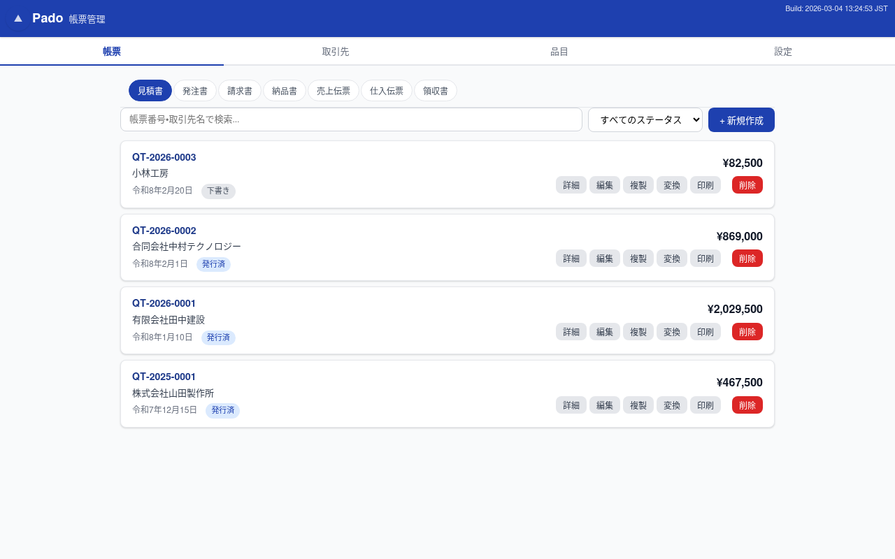 | 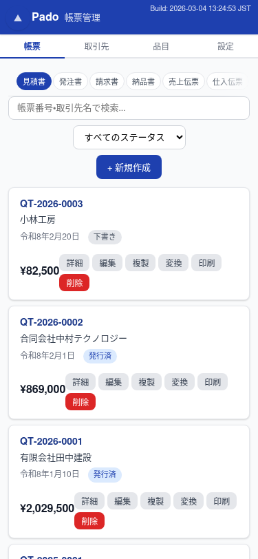 |

---

## 2. 画面構成

アプリは4つのメインタブで構成されています。画面上部のタブボタンで切り替えます。

| タブ | 内容 |
|------|------|
| **帳票** | 帳票の一覧表示・新規作成・編集・印刷 |
| **取引先** | 取引先の登録・一覧・編集 |
| **品目** | 品目（商品・サービス）の登録・一覧・編集 |
| **設定** | 自社情報・税設定・表示設定・データ管理 |

「帳票」タブにはさらに7種類の帳票サブタブがあります。

| サブタブ | 帳票種別 |
|---------|---------|
| 見積書 | 顧客への見積金額を提示 |
| 発注書 | 仕入先への発注内容を記載 |
| 請求書 | 顧客への請求金額を明示 |
| 納品書 | 商品・サービスの納品を確認 |
| 売上伝票 | 売上の記録用 |
| 仕入伝票 | 仕入の記録用 |
| 領収書 | 代金受領の証明 |

### 共通UI要素

- **左上のボタン（↑）**: ページの一番上にスクロールします
- **タブバー**: メインの4タブを切り替えます
- **サブタブバー**（帳票タブのみ）: 帳票の種類を切り替えます

---

## 3. 帳票管理

### 3.1 帳票一覧

帳票タブでは、選択した種類の帳票が一覧表示されます。各帳票カードには以下の情報が表示されます:

- 帳票番号・発行日
- 取引先名
- 合計金額
- ステータス（下書き・発行済・送付済・受領済・無効）

**検索・フィルタ**:
- 検索バーに帳票番号・取引先名を入力すると、リアルタイムで絞り込まれます
- ステータスでフィルタリングできます

### 3.2 新規帳票作成

1. 帳票タブで対象の種類（見積書、請求書など）のサブタブを選択します
2. 「＋ 新規作成」ボタンをクリックします
3. 編集フォームが開きます

### 3.3 帳票編集

帳票の編集画面は以下の5つのセクションで構成されています:

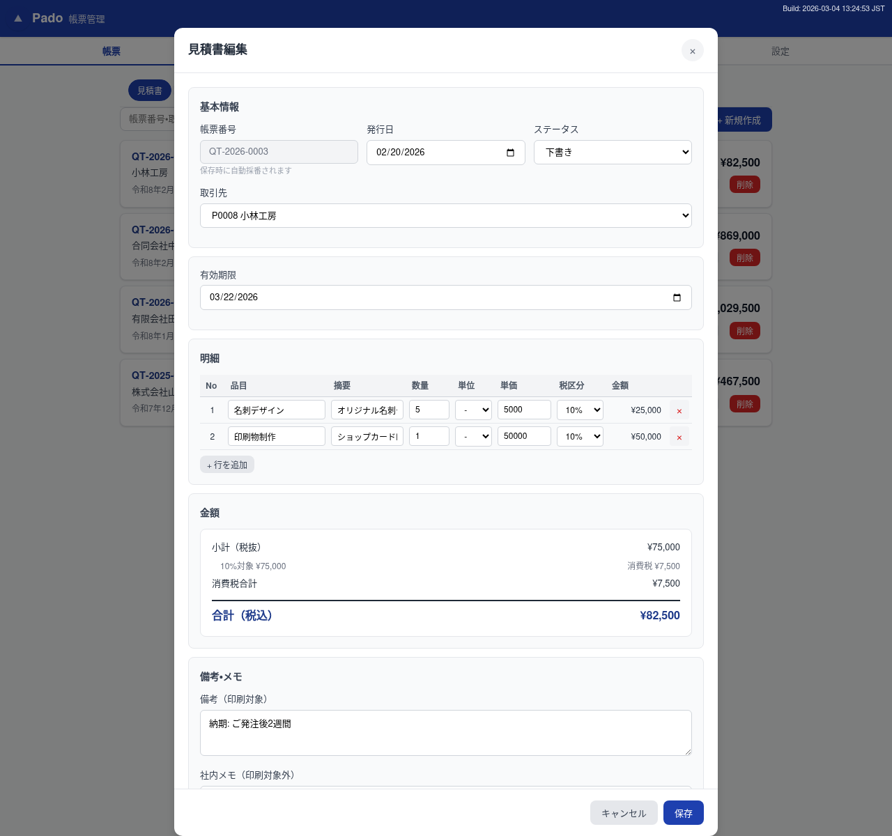

#### 基本情報

- **帳票番号**: 自動採番されます（手動入力不可）
- **発行日**: デフォルトで今日の日付が設定されます
- **ステータス**: 下書き・発行済・送付済・受領済・無効から選択
- **取引先**: 登録済みの取引先から選択

#### 帳票種別ごとの固有フィールド

| フィールド | 対象帳票 |
|-----------|---------|
| 見積有効期限 | 見積書 |
| 支払期限 | 請求書 |
| 納品日 | 納品書 |
| 但し書き | 領収書 |
| 支払方法 | 領収書 |

#### 明細行

- **品目名**: 登録済みの品目から選択、または自由入力
- **数量**: 数値を入力
- **単位**: 式・個・本・枚・台・セット・時間・人月・人日・kg・m・㎡から選択
- **単価**: 数値を入力
- **税率**: 10%（標準）・8%（軽減）・0%（非課税）から選択

「＋ 明細行を追加」ボタンで行を追加できます。各行の「×」ボタンで行を削除できます。

#### 金額サマリー

明細行を入力すると、以下が自動計算されます:
- 小計（税抜）
- 税率別の消費税額
- 合計金額（税込）

#### 備考・社内メモ

- **備考**: 印刷時に帳票に表示されます
- **社内メモ**: 印刷されない社内用のメモです

### 3.4 帳票の種類

| 種類 | 用途 | 固有フィールド |
|------|------|--------------|
| 見積書 | 金額・条件の提示 | 見積有効期限 |
| 発注書 | 仕入先への発注 | — |
| 請求書 | 代金の請求 | 支払期限 |
| 納品書 | 納品の確認 | 納品日 |
| 売上伝票 | 売上の記録 | — |
| 仕入伝票 | 仕入の記録 | — |
| 領収書 | 代金受領の証明 | 但し書き、支払方法 |

### 3.5 帳票番号の自動採番

帳票番号は種類ごとに自動採番されます。デフォルトの形式は以下のとおりです:

| 種類 | プレフィックス | 例 |
|------|-------------|-----|
| 見積書 | EST- | EST-0001 |
| 発注書 | PO- | PO-0001 |
| 請求書 | INV- | INV-0001 |
| 納品書 | DN- | DN-0001 |
| 売上伝票 | SS- | SS-0001 |
| 仕入伝票 | PS- | PS-0001 |
| 領収書 | RCP- | RCP-0001 |

プレフィックスは設定画面の「帳票番号設定」でカスタマイズできます。

### 3.6 帳票変換

帳票を別の種類に変換できます。変換可能な組み合わせは以下のとおりです:

| 変換元 | 変換先 |
|--------|--------|
| 見積書 | → 請求書、発注書、納品書 |
| 発注書 | → 仕入伝票、納品書 |
| 請求書 | → 領収書、売上伝票 |
| 納品書 | → 請求書、売上伝票 |
| 売上伝票 | → 請求書、領収書 |

**変換手順**:
1. 帳票一覧で「変換」ボタンをクリックします
2. 変換先の帳票種別を選択します
3. 新しい帳票が作成されます（元の帳票はそのまま残ります）

### 3.7 帳票の複製

「複製」ボタンで帳票のコピーを作成できます。同じ内容の帳票を繰り返し作成する場合に便利です。

### 3.8 帳票の削除

1. 帳票一覧で「削除」ボタンをクリックします
2. 確認ダイアログが表示されます
3. 「OK」をクリックすると削除されます

**注意**: 削除された帳票は復元できません。

---

## 4. 取引先管理

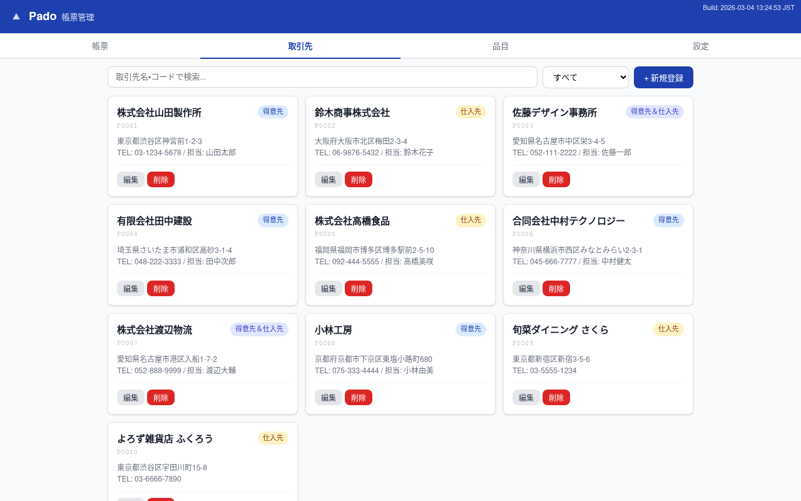

### 4.1 新規取引先登録

1. 「取引先」タブを開きます
2. 「＋ 新規登録」ボタンをクリックします
3. 登録フォームが表示されます

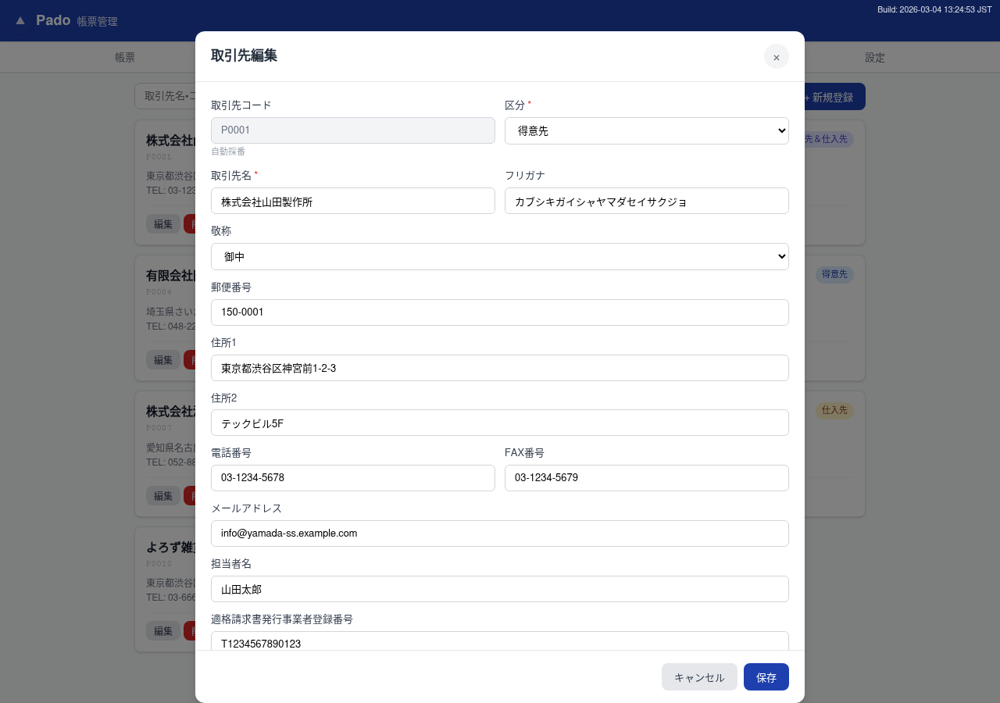

入力項目:

| フィールド | 必須 | 説明 |
|-----------|------|------|
| 取引先名 | ○ | 会社名・屋号・個人名 |
| 取引先コード | | 自動採番（P0001〜）。手動入力も可 |
| ふりがな | | カタカナ |
| 種別 | | 得意先・仕入先・両方 |
| 敬称 | | 御中・様・殿 |
| 郵便番号 | | ハイフンあり（例: 100-0001） |
| 住所1 | | 都道府県〜番地 |
| 住所2 | | ビル名・階数等 |
| 電話番号 | | |
| FAX | | |
| メールアドレス | | |
| 担当者名 | | |
| 適格請求書番号 | | T + 13桁の数字 |
| 支払条件 | | 例: 月末締め翌月末払い |
| 備考 | | 自由記入 |

### 4.2 一覧・検索

取引先タブには登録済みの全取引先がカード形式で表示されます。

**検索方法**:
- 検索バーに取引先名・ふりがな・取引先コードを入力すると、リアルタイムで絞り込まれます
- 種別（得意先・仕入先）でフィルタリングできます

### 4.3 編集・削除

- 各カードの「編集」ボタンで登録内容を修正できます
- 「削除」ボタンで取引先を削除できます

**注意**: 取引先を削除しても、その取引先が設定された既存の帳票には影響しません。

---

## 5. 品目管理

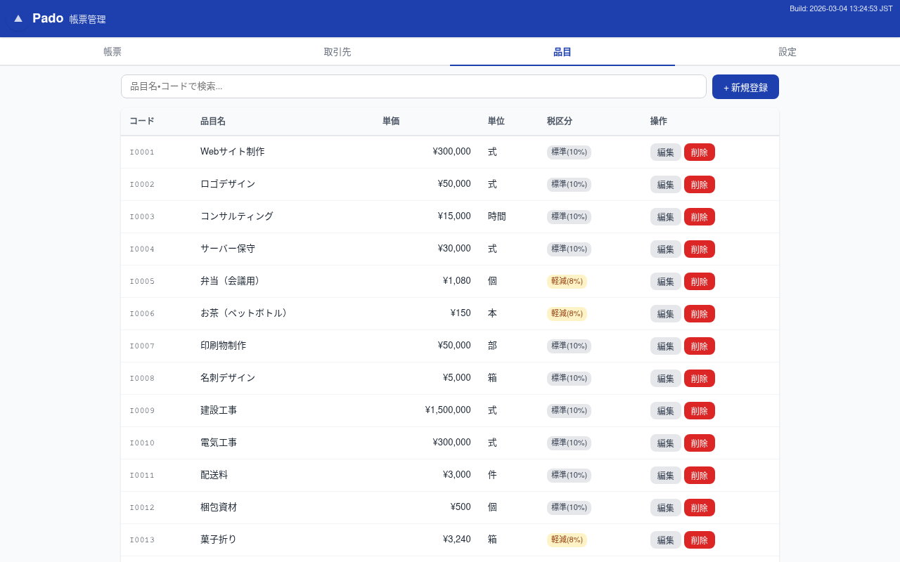

### 5.1 新規品目登録

1. 「品目」タブを開きます
2. 「＋ 新規登録」ボタンをクリックします
3. 登録フォームが表示されます

入力項目:

| フィールド | 必須 | 説明 |
|-----------|------|------|
| 品目名 | ○ | 商品・サービスの名称 |
| 品目コード | | 自動採番。手動入力も可 |
| 説明 | | 品目の詳細説明 |
| 単価 | | デフォルトの単価 |
| 単位 | | 式・個・本・枚など |
| 税区分 | | 標準税率(10%)・軽減税率(8%)・非課税(0%) |
| 表示順 | | 一覧での並び順 |

### 5.2 一覧・検索

品目タブにはテーブル形式で品目が一覧表示されます。検索バーで品目名・品目コードで絞り込みができます。

### 5.3 編集・削除

- テーブル内の「編集」ボタンで内容を修正できます
- 「削除」ボタンで品目を削除できます

---

## 6. 設定

### 6.1 自社情報

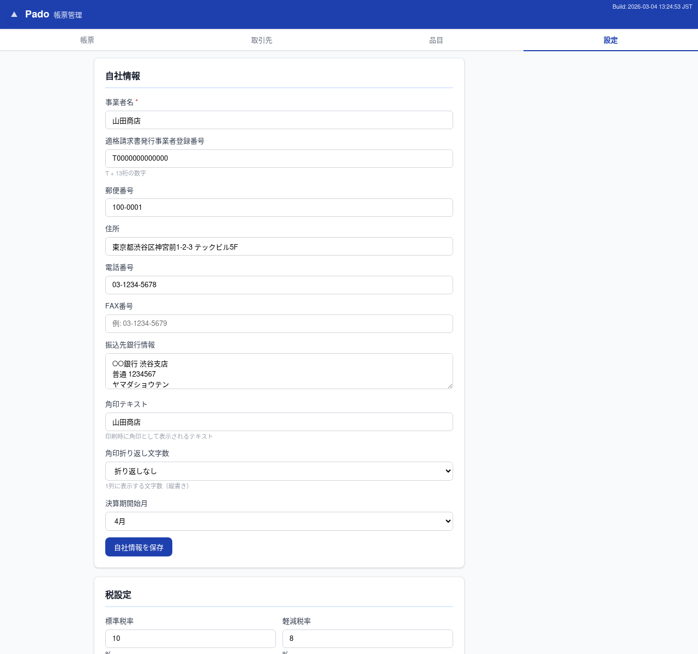

自社の基本情報を設定します。ここで入力した内容が帳票に印字されます。

| フィールド | 説明 |
|-----------|------|
| 事業者名 | 会社名・屋号 |
| 適格請求書発行事業者登録番号 | T + 13桁の数字 |
| 郵便番号 | |
| 住所 | |
| 電話番号 | |
| FAX | |
| 振込先情報 | 帳票に表示される銀行口座情報 |
| 角印テキスト | 帳票に表示される角印の文字列 |
| 角印折返し文字数 | 角印内の1行あたりの文字数 |
| 決算開始月 | 年度の開始月 |

### 6.2 税設定

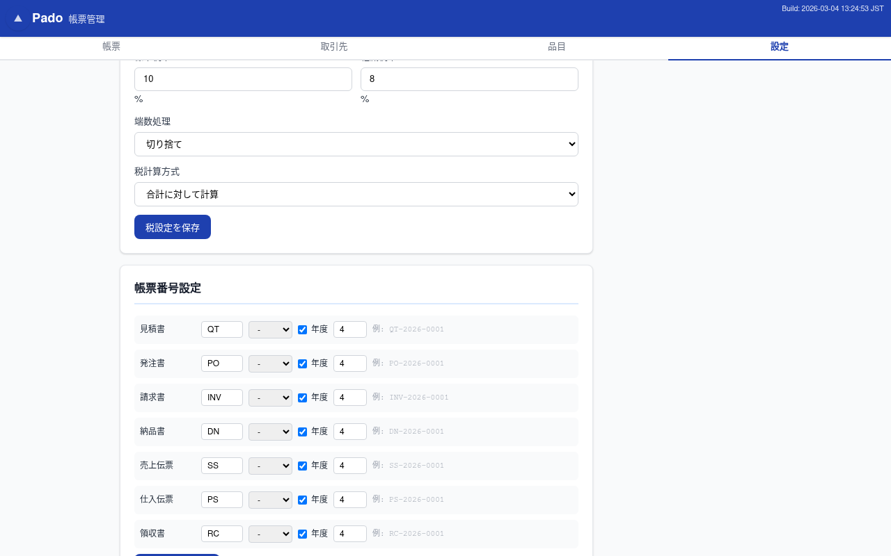

| 設定項目 | 説明 | デフォルト値 |
|---------|------|------------|
| 標準税率 | 通常の消費税率 | 10% |
| 軽減税率 | 食品等の軽減税率 | 8% |
| 端数処理 | 切り捨て・四捨五入・切り上げ | 切り捨て |
| 計算方式 | 合計後一括計算・明細行ごと計算 | 合計後一括 |

### 6.3 帳票番号設定

帳票種別ごとにプレフィックス（接頭辞）をカスタマイズできます。

### 6.4 表示設定

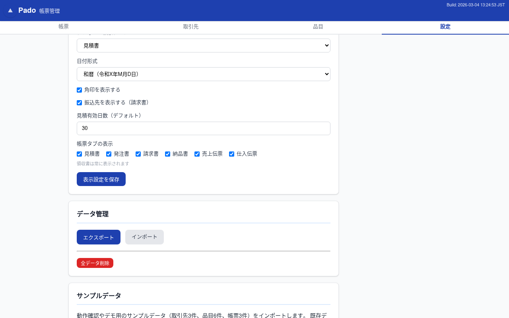

| 設定項目 | 説明 |
|---------|------|
| デフォルト帳票タイプ | アプリ起動時に表示する帳票種別 |
| 日付形式 | 和暦（令和○年）・西暦（2026年） |
| 角印を表示 | 帳票印刷時に角印を表示するか |
| 振込先を表示 | 帳票印刷時に振込先を表示するか |
| 見積有効日数 | 見積書のデフォルト有効期限日数 |
| タブ表示 | 使わない帳票タブを非表示にできます |

### 6.5 データ管理

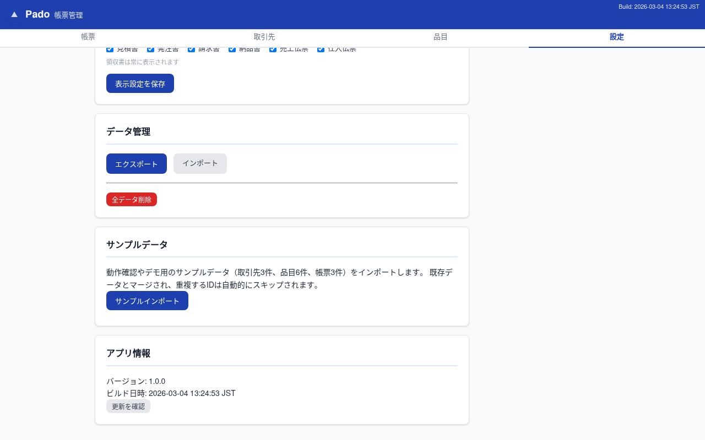

#### エクスポート（バックアップ）

1. 「設定」タブを開きます
2. 「エクスポート」ボタンをクリックします
3. JSON形式のバックアップファイルがダウンロードされます

ファイル名: `pado_backup_YYYYMMDD_HHMMSS.json`

**定期的なバックアップを推奨します。**

#### インポート（復元）

1. 「設定」タブを開きます
2. 「インポート」ボタンをクリックし、バックアップファイルを選択します
3. データが読み込まれ、既存データとマージされます

- 同じIDのデータは上書きされます

#### 全データ削除

1. 「全データ削除」ボタンをクリックします
2. 確認ダイアログが表示されます
3. 「OK」をクリックすると、すべてのデータが削除されます

**注意**: 削除されたデータは復元できません。事前にエクスポートすることを推奨します。

### 6.6 サンプルデータ

「サンプルデータをインポート」ボタンで、デモ用のサンプルデータ（取引先10件、品目15件、帳票24件）をインポートできます。動作確認やデモに便利です。

※ サンプルインポートはオンライン環境でのみ利用可能です。

### 6.7 アプリ情報

- アプリのバージョンとビルド日時が表示されます
- 「更新を確認」ボタンで、新しいバージョンが利用可能か確認できます

---

## 7. 印刷

### 7.1 A4帳票の印刷

見積書・発注書・請求書・納品書・売上伝票・仕入伝票はA4形式で印刷されます。

**印刷手順**:
1. 帳票一覧で印刷したい帳票の「印刷」ボタンをクリックします
2. ブラウザの印刷ダイアログが表示されます
3. 用紙サイズA4・余白なしを推奨します

**A4帳票に印字される内容**:
- 帳票タイトル・帳票番号・発行日
- 取引先情報（名称・住所・適格請求書番号）
- 自社情報（名称・住所・電話番号・振込先）
- 明細テーブル（品目名・数量・単位・単価・金額・税率）
- 金額サマリー（小計・消費税・合計）
- 備考

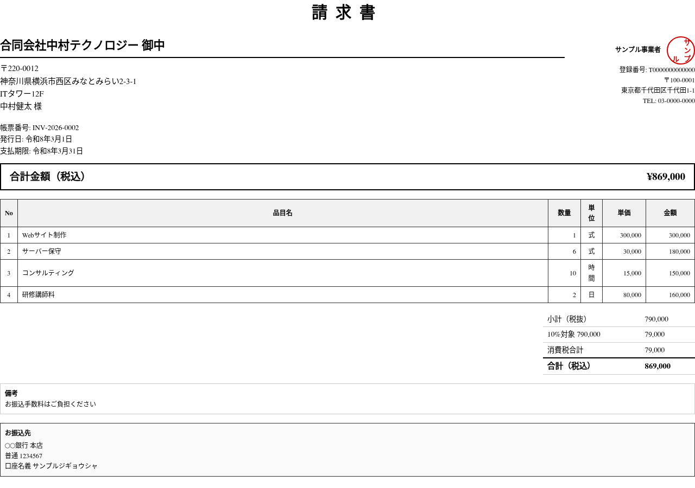

### 7.2 領収書の印刷

領収書は専用のレイアウトで印刷されます。

**領収書に印字される内容**:
- 領収金額
- 但し書き
- 支払方法
- 収入印紙欄（金額が5万円以上の場合に表示）
- 自社情報・角印

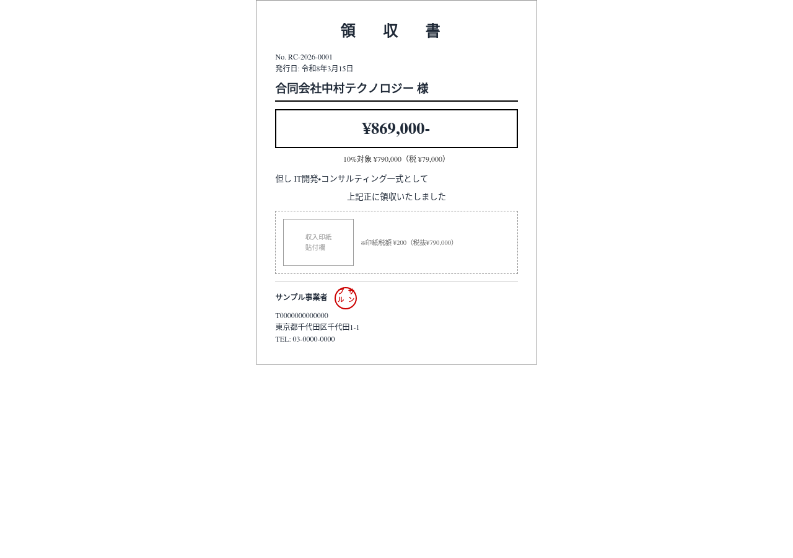

### 7.3 角印の表示

帳票には自社の角印（社印）を表示できます。角印は設定画面で入力したテキストが縦書きで表示されます。

**角印の設定**:
- **角印テキスト**: 表示する文字列（例: 山田商店）
- **折返し文字数**: 1行あたりの文字数を指定します。長い社名の場合に改行位置を調整できます

角印の表示・非表示は「設定 > 表示設定 > 角印を表示」で切り替えられます。

---

## 8. データの保存について

### 8.1 保存場所

すべてのデータは、お使いのブラウザ内（IndexedDB）に保存されます。外部のサーバーに送信されることはありません。

### 8.2 データの永続性

- ブラウザを閉じてもデータは保持されます
- ただし、ブラウザのキャッシュクリアやデータ削除を行うと、データが失われる場合があります

### 8.3 バックアップの重要性

データの紛失を防ぐため、定期的にエクスポート（バックアップ）を行うことを推奨します。

**推奨バックアップ頻度**: 週1回以上

### 8.4 端末の移行

他の端末にデータを移行する場合:

1. 移行元の端末でエクスポートを実行
2. エクスポートされたJSONファイルを移行先の端末に転送
3. 移行先の端末でインポートを実行

### 8.5 PWA（ホーム画面への追加）

Pado はPWA（Progressive Web App）に対応しています。ブラウザのメニューから「ホーム画面に追加」を選択すると、アプリのようにホーム画面から起動できます。オフライン環境でもすべての機能が利用可能です。
