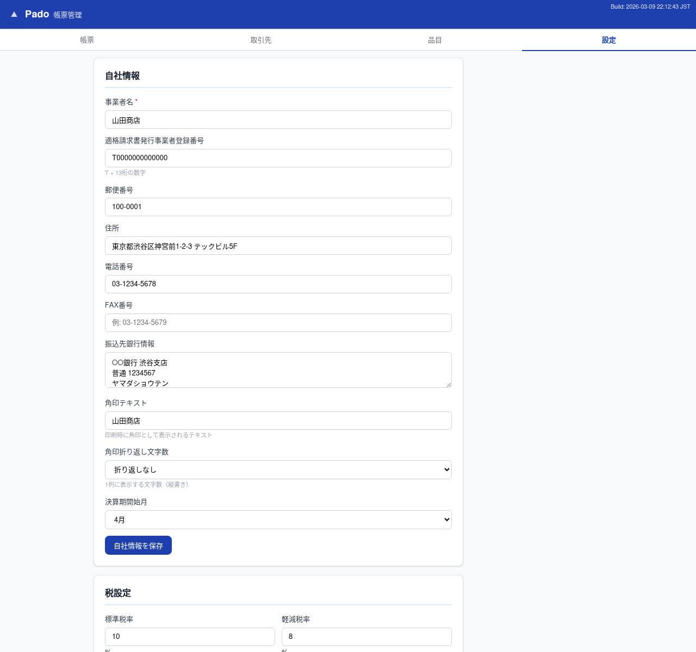
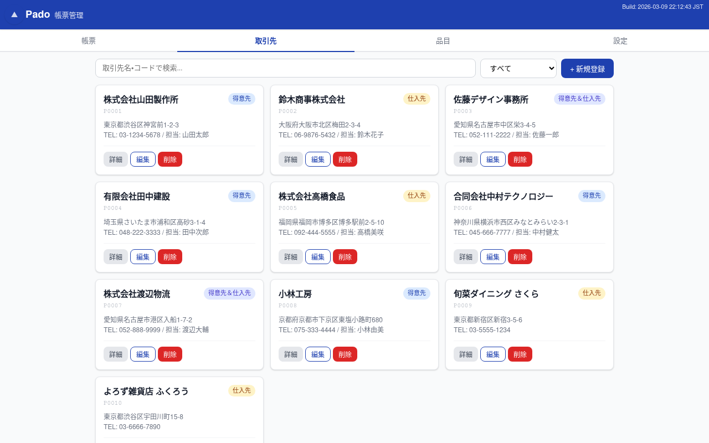
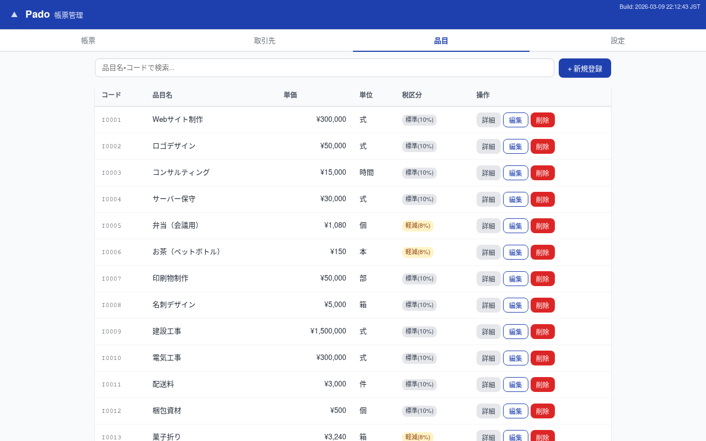
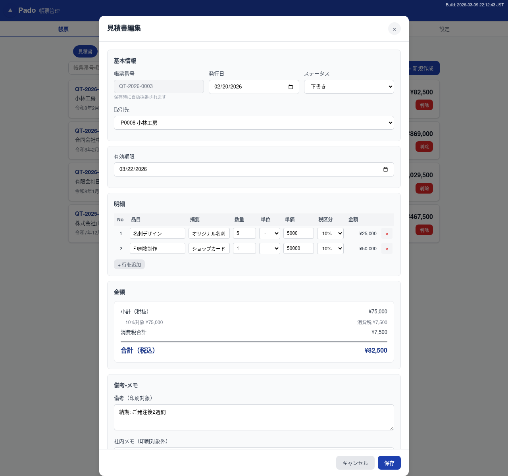
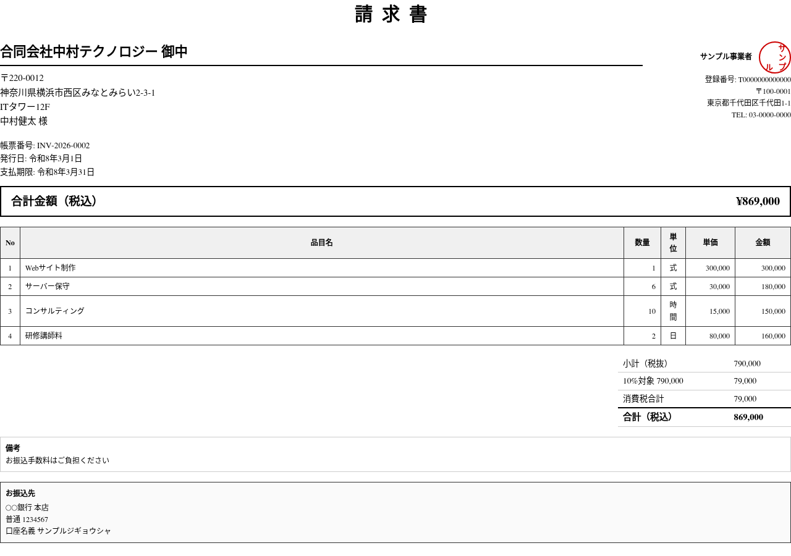
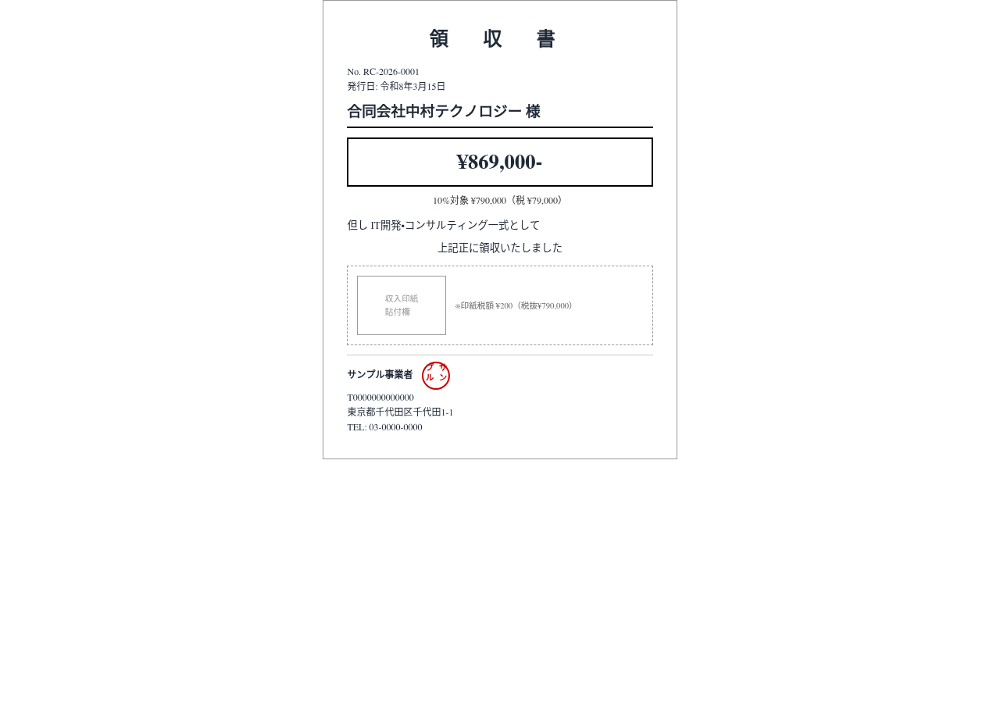
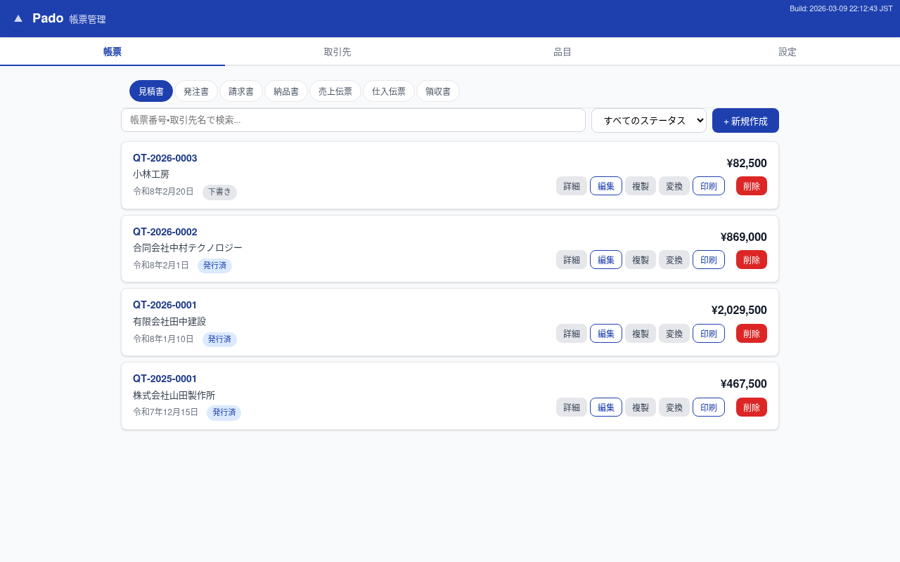
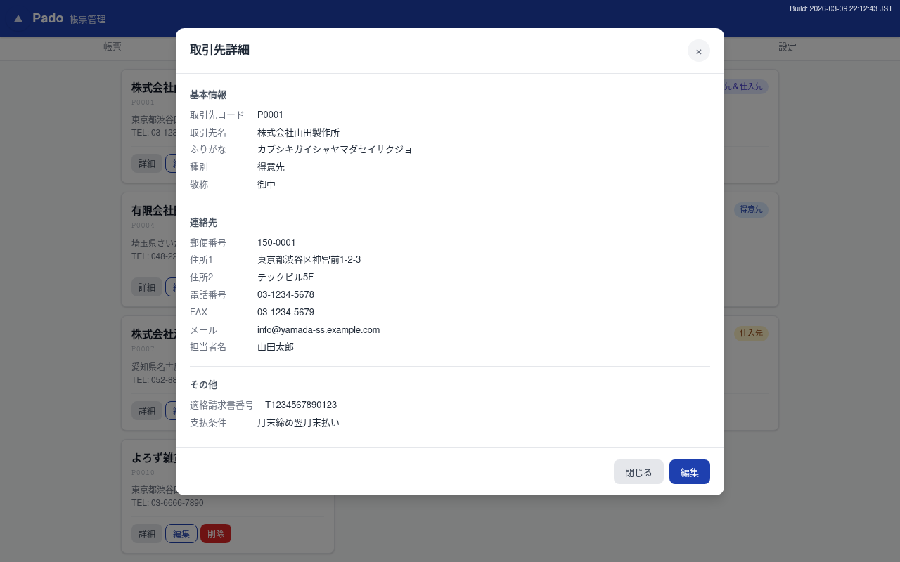
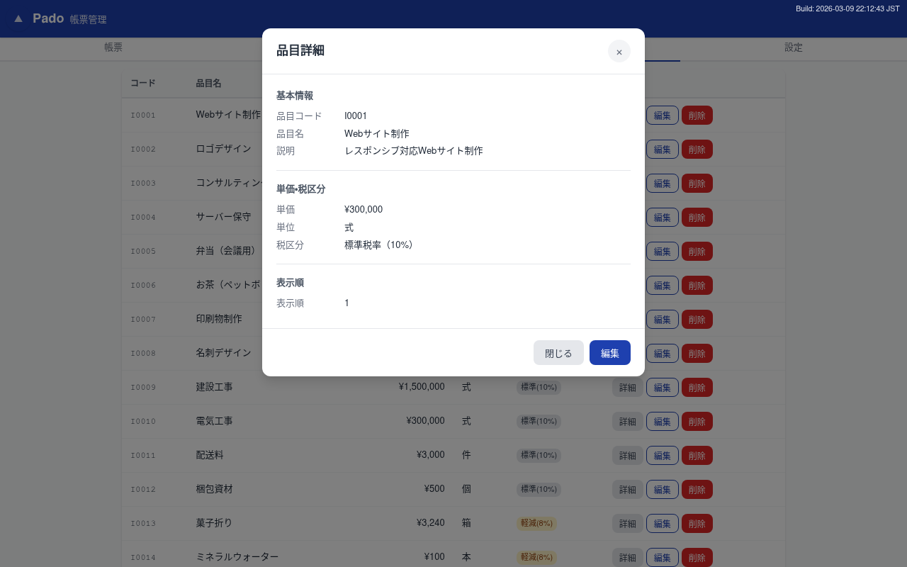
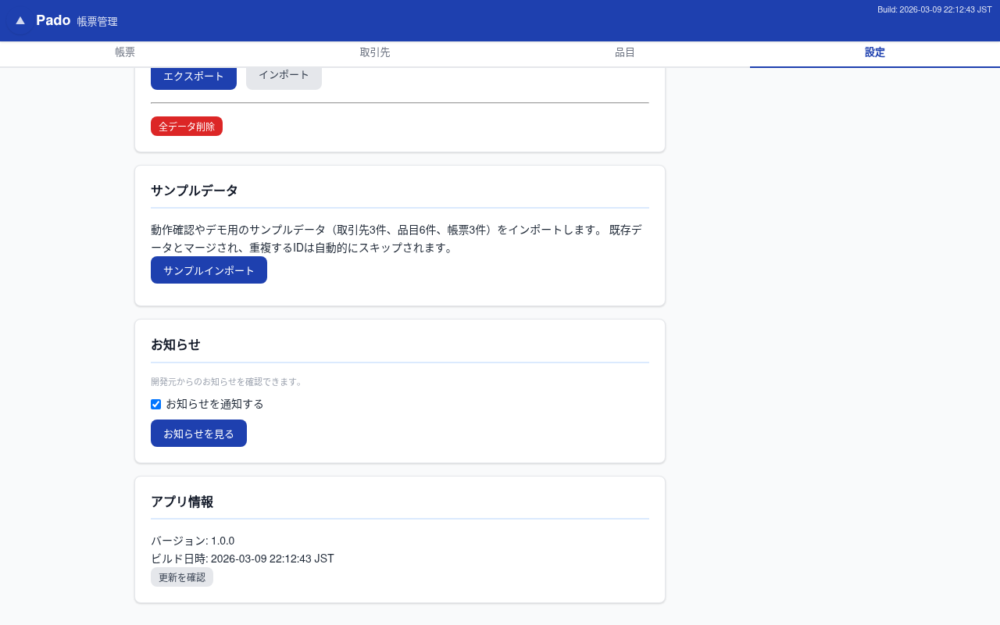

# Pado 活用事例 — フリーランスデザイナーの帳票管理

**「もう、帳票番号をExcelで手打ちする必要はありません」**

東京・目黒のフリーランスWebデザイナー「Studio Sato」は、帳票管理に Pado を導入しました。佐藤美咲さんが一人で運営する小さなデザイン事務所が、どのように Pado を活用しているのか — 8つのシーンでご紹介します。

---

## UC1: 開業準備 — 初期セットアップ

Pado を開いたら、まず設定タブで自社情報を登録します。事業者名・住所・電話番号・振込先を入力して保存するだけ。アカウント登録もメールアドレスも不要です。

税設定では標準税率10%と軽減税率8%を確認し、端数処理を「切り捨て」に設定。表示設定では日付形式を「和暦」に、角印と振込先の印刷表示をONにします。

**ポイント**
- 帳票番号のプレフィックス（QT, INV, RC など）はカスタマイズ可能
- 使わない帳票タブ（仕入伝票など）は非表示にして画面をすっきり
- 見積有効日数のデフォルト（30日）を設定しておけば、毎回入力不要

---

## UC2: 取引先と品目の登録 — マスタデータ準備

取引先タブから得意先「株式会社ミドリ商事」と仕入先「デザインツール商社」を登録。品目タブではよく使うサービスメニュー（Webサイト制作、ロゴデザインなど）を単価・税区分付きで登録します。

 

**ポイント**
- 取引先コードは自動採番（P0001, P0002...）、手入力不要
- 品目に単価と税区分を登録しておけば、帳票作成時に選ぶだけで自動入力
- 標準税率と軽減税率の品目を混在登録OK

---

## UC3: 見積書の作成 — 最初の帳票

帳票タブの「見積書」サブタブから新規作成。取引先をドロップダウンから選び、明細行で品目を選択すると単価が自動入力されます。

3行の明細を入力すると、税率別の消費税（10%と8%を自動分離）と合計金額がリアルタイムで計算されます。見積有効期限も30日後が自動設定。

保存後、帳票番号が `QT-2026-0001` のように自動採番。「詳細」ボタンで保存内容を確認し、「印刷」ボタンで角印付きのA4帳票をプレビューできます。

**ポイント**
- 品目ドロップダウンから選ぶだけで単価・税区分が自動入力
- 標準税率と軽減税率の混在を自動で分離計算
- 帳票番号は種類ごとに自動採番（QT-年度-連番）
- 印刷プレビューにインボイス登録番号が自動表示

---

## UC4: 受注から入金まで — 帳票変換ワークフロー

見積書がOKになったら、「変換」ボタンから請求書に変換。明細行がそのままコピーされ、転記ミスはゼロ。変換元リンクで「どの見積書から作ったか」が一目瞭然です。

請求書からは「領収書」にもワンクリック変換。但し書きを入力すれば、収入印紙の要否と金額も自動判定されます。

領収書は専用のコンパクトレイアウトで印刷。収入印紙欄も自動表示されます。

 

**ポイント**
- 見積書 → 請求書 → 領収書と、業務の流れに沿ってワンクリック変換
- 変換元リンクで帳票間のトレーサビリティを確保
- 収入印紙は税抜金額から自動判定（5万円以上で必要）
- 請求書 → 売上伝票の変換で、売上管理も同時に

---

## UC5: 仕入業務 — 発注から仕入計上まで

発注書を新規作成して仕入先に送付。入荷後は「変換」から納品書を作成。さらに納品書から売上伝票、発注書から仕入伝票への変換も可能です。

見積書から発注書への変換にも対応しているので、仕入業務もPadoで完結します。

**ポイント**
- 発注書 → 納品書の受入フローと、納品書 → 売上伝票の売上計上に対応
- 発注書 → 仕入伝票で仕入計上も管理
- 見積書 → 発注書の変換で、受け取った見積もりをそのまま発注に

---

## UC6: 帳票の検索と日常管理

帳票が増えてきても大丈夫。検索バーに帳票番号や取引先名を入力すれば、瞬時に絞り込めます。ステータスフィルターで「発行済」だけを表示したり、サブタブで帳票種類を切り替えたり。

帳票の編集（ステータス変更など）や削除も、一覧画面からワンクリックで操作できます。

**ポイント**
- 帳票番号・取引先名で部分一致検索
- ステータスフィルター（下書き・発行済・送付済など）で絞り込み
- 7種類の帳票サブタブで種類ごとに一覧管理
- 売上伝票の直接作成や、売上伝票→領収書の変換も対応

---

## UC7: マスタデータの活用 — 検索・編集・削除

取引先や品目が増えてきたら、検索機能で素早く見つけられます。取引先は名前検索と種別フィルター（得意先/仕入先）の組み合わせで効率的に絞り込み。

「詳細」ボタンで読み取り専用の一覧表示、「編集」ボタンで変更、「削除」ボタンで不要なデータを整理できます。

 

**ポイント**
- 取引先・品目の詳細表示オーバーレイで情報を素早く確認
- 詳細画面から直接「編集」に遷移できる
- 取引先の種別フィルター（得意先・仕入先）で表示を切り替え
- 不要な品目・取引先は削除で整理。帳票に使用済みのデータは影響なし

---

## UC8: データ保全 — バックアップと復元

スマートフォンの機種変更や万が一のデータ消失に備えて、設定タブの「データ管理」からワンタップでバックアップ。JSON形式のファイルとしてダウンロードされます。

**ポイント**
- エクスポートファイルには取引先・品目・帳票・設定のすべてが含まれる
- インポートで別の端末にデータをそのまま復元可能
- データはすべて端末内（ブラウザ）に保存。外部サーバーへの送信は一切なし

---

## まとめ — Pado が Studio Sato にもたらした変化

Pado の導入により、佐藤さんの帳票業務は大きく変わりました。

- **転記ミスゼロ** — 見積書→請求書→領収書をワンクリック変換。コピペミスから解放
- **番号管理の自動化** — 帳票番号は種類ごとに自動採番。Excelの連番管理から卒業
- **インボイス制度対応** — 登録番号・税率別消費税を自動レイアウト。制度対応の不安を解消
- **どこでも使える** — スマホでもPCでも、ブラウザさえあればOK。月額費用ゼロ

すべてブラウザだけで完結。月額料金もアカウント登録も不要。データは端末内に安全に保存されます。

---

## 今すぐ試してみましょう

サンプルデータを読み込めば、このページで紹介した機能をすぐに体験できます。

[**Pado を試してみる →**](index.html)

使い方を詳しく知りたい方は [**ユーザーマニュアル →**](manual.html) をご覧ください。

Pado の機能概要・比較は [**プロモーションページ →**](promotion.html) をご覧ください。

---

Pado はオープンソースソフトウェアです（MIT License）。
